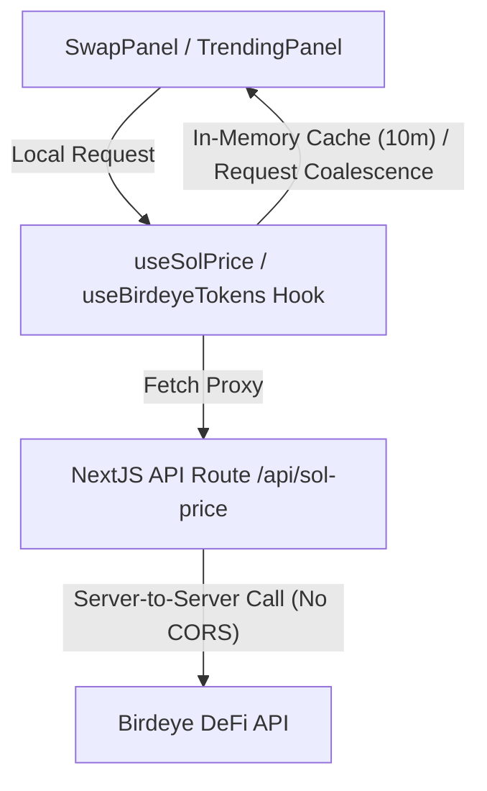

# ChadWallet - Solana Meme Trading Interface

ChadWallet is a high-fidelity web interface built with Next.js and React for tracking and trading Solana meme tokens. This repository has been updated with real-time market data integration from the Birdeye API and interactive chart controls.

## Key Features & Implementations

### 1. Live Birdeye Token API Integration
* **API Endpoint Proxy (`/api/tokens`)**: Established a server-side route fetching real Solana meme tokens sorted by progress/liquidity/volume using the Birdeye Meme List API.
* **Custom React Hook (`useBirdeyeTokens`)**:
  * Powers the `TokenBanner` and `TrendingPanel` components.
  * Implements **Request Coalescing** so concurrent hook instances share the same network promise.
  * Implements **Client-side Caching** to minimize redundant hits to the backend server.

### 2. Live SOL Price Endpoint & Hook
* **CORS Proxy Routing (`/api/sol-price`)**: Bypasses browser `strict-origin-when-cross-origin` CORS restrictions by querying the Birdeye DeFi Price endpoint on the server side.
* **Custom React Hook (`useSolPrice`)**:
  * Exposes `{ solPrice, loading, error }` states.
  * Features a **10-minute client-side cache** and promise coalescing to protect against API key rate-limits.
  * Fully integrated into the `SwapPanel` component for live SOL-to-token quantity calculations without page layout changes.

### 3. TradingView Chart Integration
* Embedded a real-time TradingView widget that dynamically tracks token price charts.
* Designed premium custom loaders and skeleton components matching ChadWallet's neon and dark aesthetic during frame loads.

---

## Technical Architecture



## Getting Started

### 1. Setup Environment Variables
Create a `.env` or `.env.local` file in the root directory:
```env
NEXT_PUBLIC_PRIVY_APP_ID=your_privy_app_id
BIRDEYE_API_KEY=your_birdeye_api_key
```

### 2. Run the Development Server
Install dependencies and run the server:
```bash
npm install
npm run dev
```

Open [http://localhost:3000](http://localhost:3000) with your browser to experience the dashboard.
